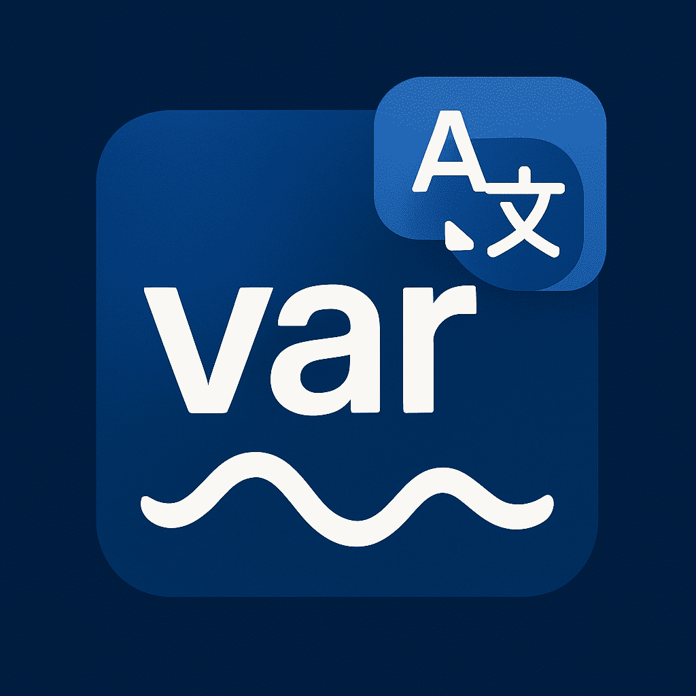

# Var Name

A VSCode extension powered by LLM API that translates text into various programming language variable naming conventions.

🤖 The extension uses [SiliconFlow's Qwen/QwQ-32B](https://docs.siliconflow.cn/en/api-reference/chat-completions/chat-completions) free model by default, which can be used out of the box.

English | [中文](./README-zh_CN.md)

## ✨ Features

- 🚀 Quick access via shortcut (Ctrl+Shift+T / Cmd+Shift+T)
- 🤖 Multiple AI model support (OpenAI, DeepSeek, Qwen, etc.)
- 📝 Generates multiple naming conventions:
  - camelCase
  - PascalCase
  - snake_case
  - CONSTANT_CASE
  - kebab-case
- ⌨️ Keyboard navigation and one-click copy
- ⚙️ Flexible configuration options

## 📥 Installation

1. Open the Extensions panel in VSCode (Ctrl+Shift+X)
2. Search for "Var Name"
3. Click Install

## ⚙️ Configuration

| Key | Description | Value |
|-----|-------------|--------|
| `var-name.apiKey` | API Key | Your API key string |
| `var-name.baseURL` | Custom API URL | Optional custom endpoint |
| `var-name.model` | Model Name | Model identifier string |

## 🎯 Usage

1. Press shortcut `Ctrl+Shift+T` (Mac: `Cmd+Shift+T`)
2. Enter Chinese text in the input box
3. Wait for AI translation
4. Use arrow keys to select naming convention
5. Press Enter to copy to clipboard

## 💡 Example

Input: `是否显示弹窗`

Output:
- camelCase: `isShowModal`
- PascalCase: `IsShowModal`
- snake_case: `is_show_modal`
- CONSTANT_CASE: `IS_SHOW_MODAL`
- kebab-case: `is-show-modal`